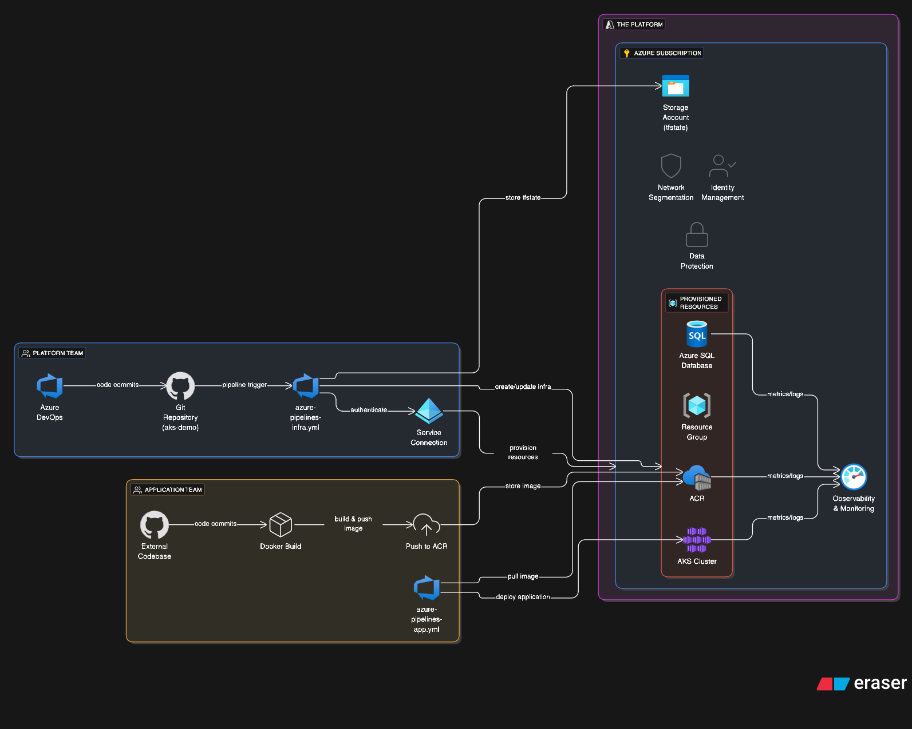
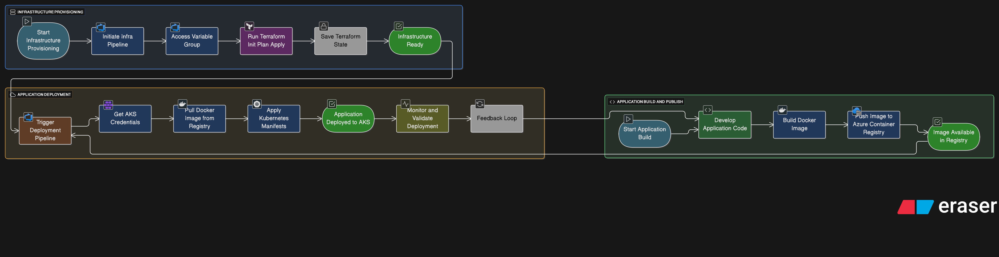

# AKS Demo Deployment with Terraform & Azure DevOps

This repository contains a Terraform module to provision an Azure Kubernetes Service (AKS) cluster and an Azure SQL database. It also includes the necessary Kubernetes manifest files to deploy a simple web application to the cluster.

The entire process is automated using Azure DevOps Pipelines, demonstrating a complete infrastructure-as-code (IaC) and CI/CD workflow. The project is structured as a monorepo to separate infrastructure, application, and deployment concerns.

## Project Structure

-   **`.azdo/`**: Contains the Azure DevOps pipeline YAML files.
    -   `azure-pipelines-infra.yml`: The pipeline to provision Azure infrastructure with Terraform.
    -   `azure-pipelines-app.yml`: The pipeline to deploy the application to an AKS cluster.
-   **`infra/`**: Contains the reusable Terraform code for provisioning the AKS cluster and Azure SQL.
-   **`app/`**: Contains the source code for the simple web application and its `Dockerfile`.
-   **`deploy/`**: Contains the Kubernetes manifests and scripts for deploying the application.
-   **`README.md`**: This file.



## Prerequisites

-   An **Azure DevOps Organization** with a valid parallelism grant.
-   **Azure CLI** installed and configured.
-   **Terraform CLI** installed and configured.
-   **Docker** and **kubectl** installed for local testing.

---

## For Platform Engineers 🛠️

### CI/CD Workflow for Infrastructure

As a platform engineer, your primary responsibility is to manage the hosting environment.

#### 1. Initial Setup

Set up the core resources and connections in Azure DevOps once.

-   **Create the Terraform Backend**: Create a dedicated Azure Storage Account to store the Terraform state files. This is a crucial step for managing infrastructure and collaboration. Use the following Azure CLI commands to create a resource group, storage account, and container for your state files.
    ```bash
    # Create a resource group for your backend storage account
    az group create --name terraform-backend-rg --location eastus

    # Create the storage account
    az storage account create --name aksdemotfabc123 --resource-group terraform-backend-rg --location eastus --sku Standard_LRS

    # Create the blob container
    az storage container create --name tfstate --account-name aksdemotfabc123
    ```

-   **Service Connection**: Go to **Project settings > Service connections** and create an **Azure Resource Manager** connection. Name it `aks-demo-service-connection`.
-   **Variable Groups**: Go to **Pipelines > Library** and create a new **Variable Group** for each environment (e.g., `aks-demo-dev-vars`). Store your environment-specific configuration here.

#### 2. Provisioning Infrastructure

The `azure-pipelines-infra.yml` pipeline automates the provisioning process.

-   **Create the Pipeline**: In Azure DevOps, create a new pipeline from the `infra` YAML file on your feature branch.
-   **Run the Pipeline**: Manually trigger the pipeline and select the desired variable group (e.g., `aks-demo-dev-vars`). The pipeline will provision all necessary infrastructure for that environment.

#### 3. Rolling Out Changes

To make changes to the infrastructure, update the Terraform files in the `infra/` folder.

-   Commit the changes to your Git branch.
-   Trigger the `azure-pipelines-infra.yml` pipeline, which will apply the changes to your existing infrastructure.



### How to Onboard New Teams 🚀

To onboard a new team, you simply repeat the provisioning process with a new configuration.

1.  **Create a New Variable Group**: Create a new Variable Group in the Azure DevOps library (e.g., `team-alpha-prod-vars`) with the specific names and location for the new team's cluster.
2.  **Provision the New Cluster**: Run the `azure-pipelines-infra.yml` pipeline manually and select the new variable group. This creates an isolated cluster for the new team.

---

## For Application Engineers 💻

### How to Build & Deploy on the Platform

Your responsibility is to build and deploy your application to the platform provided by the platform team.

#### 1. Building the Docker Image

The `app/Dockerfile` in this repository is designed to build your application image.

-   To build and test the image locally, use the following command. Note the `--platform` flag to ensure compatibility with AKS nodes.
    ```bash
    docker build --platform linux/amd64 -t <your-acr-name>.azurecr.io/aks-demo-app:latest .
    ```
-   Push the image to the Azure Container Registry provided by the platform team.
    ```bash
    docker push <your-acr-name>.azurecr.io/aks-demo-app:latest
    ```

#### 2. Setting Up the CI/CD Pipeline

The platform team will provide you with a deployment pipeline based on `azure-pipelines-app.yml`.

-   **Get Access**: The platform team will provide you with a Service Connection to the hosting environment.
-   **Link the Pipeline**: In Azure DevOps, create a new pipeline that points to the `azure-pipelines-app.yml` file. Link it to the Service Connection and Variable Group provided by the platform team.

### 3. Verifying the Deployment ✅

After the deployment pipeline completes, use these `kubectl` commands to verify the application is running correctly.

-   **Check the Pod Status**: Ensure your application pods are in the `Running` state.
    ```bash
    kubectl get pods
    ```
-   **View the Deployment Status**: Check the rollout status of your deployment.
    ```bash
    kubectl rollout status deployment/aks-demo-deployment
    ```
-   **Get the Service URL**: Retrieve the external IP address of your application's Service. This may take a few minutes to be assigned.
    ```bash
    kubectl get service aks-demo-service -o jsonpath='{.status.loadBalancer.ingress[0].ip}'
    ```
-   **Check the Pod Logs**: If the pods are not in the `Running` state, check the logs for errors. First, get the pod name, then view its logs.
    ```bash
    kubectl get pods
    kubectl logs <pod-name>
    ```

---
## Local Development & Troubleshooting Guide

### Local Testing

To test your Terraform code locally, use a temporary `.tfvars` file and run `terraform plan` with the `-var-file` flag.

-   **NOTE**: Do **NOT** commit this file to Git. All production and environment-specific variables are managed in Azure DevOps Variable Groups.

### Troubleshooting Common Issues

* **`Error: No hosted parallelism has been purchased or granted.`**: Fill out the Azure DevOps parallelism request form at `https://aka.ms/azpipelines-parallelism-request`.
* **`ImagePullBackOff` or `401 Unauthorized`**: Your cluster cannot pull images from the ACR.
    -   Confirm that your cluster's identity has the **`AcrPull`** role on the ACR. The best practice is to use `az aks update --attach-acr <your-acr-name>`.
    -   After assigning the role, run `kubectl rollout restart deployment/aks-demo-deployment` to force an immediate image pull.
* **`kubectl` is pointing to the wrong cluster**: Run `az aks get-credentials` to get the correct credentials and `kubectl config use-context <cluster-name>` to switch between clusters.

### Useful `kubectl` Commands

-   `kubectl get service -o wide`: Get detailed service information, including the external IP.
-   `kubectl get pods`: List all pods in the cluster.
-   `kubectl rollout restart deployment/<deployment-name>`: Force a new deployment.
-   `kubectl describe pod <pod-name>`: View detailed information and events for a pod.
-   `kubectl logs <pod-name>`: View the logs from a container in a pod.